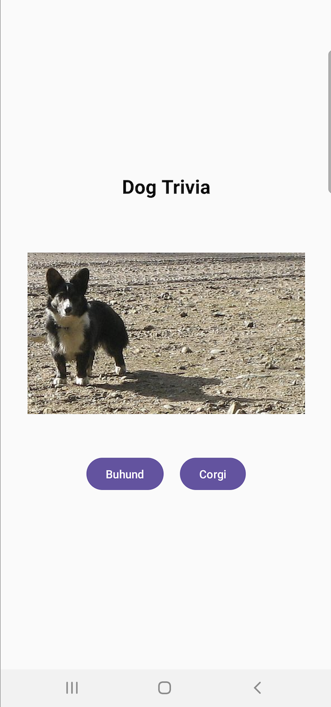
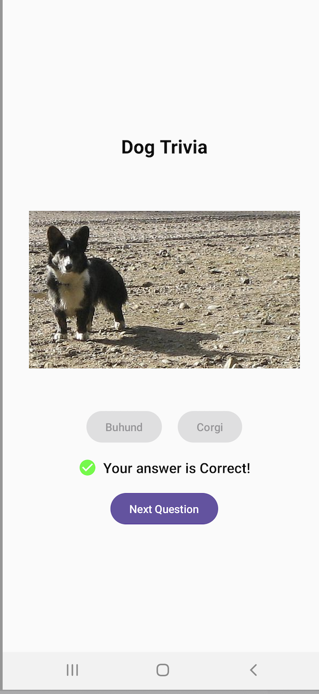

# Dog Breed Quiz App

A simple Android app to help you identify dog breeds using images. This app fetches images from a public API and quizzes you on the breed. It provides feedback to enhance your learning experience.

## Features

- Displays a random dog image and asks for the breed.
- Provides immediate feedback on your answer.
- Offers a new question after each attempt.
- Utilizes Jetpack Compose for a modern, native UI experience.

## Architecture

- **MVVM** (Model-View-ViewModel) architecture for clear separation of concerns.
- **Repository Pattern** for data management and retrieval.
- **Jetpack Compose** for UI components.

## Screenshots

